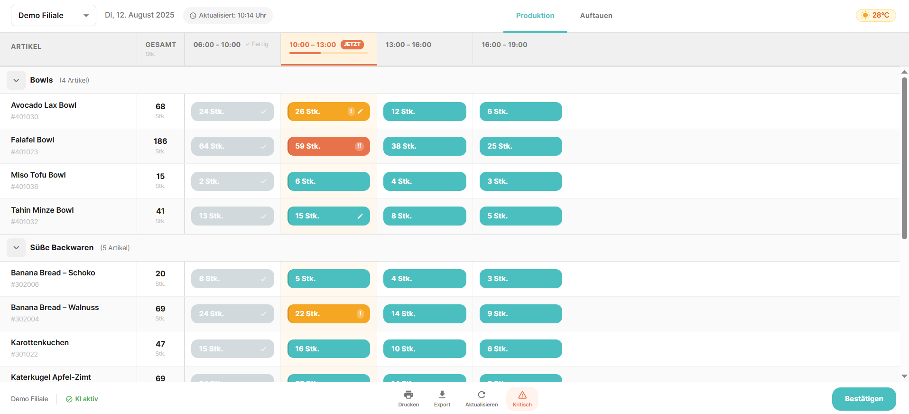
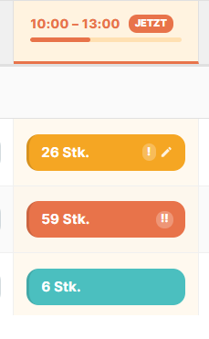
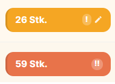
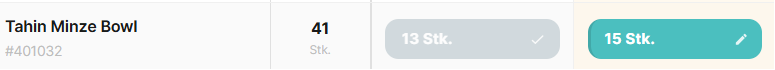
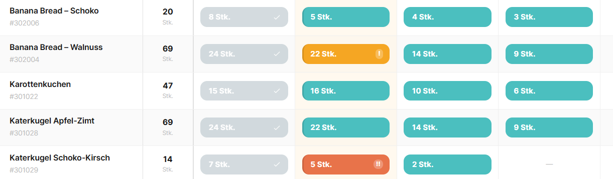
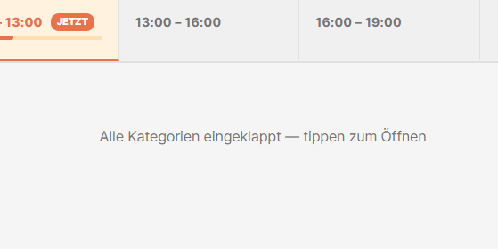

# Foodforecast – Production Plan Redesign Concept

An independent improvement concept for [Foodforecast](https://foodforecast.com), a AI FoodTech startup that provides demand forecasting for bakeries, supermarkets, and food-service operators.

This project rebuilds their **Production Plan** interface, the tablet-mounted screen used by kitchen staff throughout the day, with a focus on real operational UX problems identified through careful study of their publicly available product screenshots and documentation.

> **Disclaimer:** This is an independent redesign concept built for portfolio purposes, based on publicly available screenshots from foodforecast.com. It is not affiliated with or endorsed by Foodforecast Technologies GmbH.

---

## What was improved and why



### 1. Active time slot indicator

**Problem:** The original screen treats all time slots visually equally. A baker cannot instantly see which slot is current without reading every column header.

**Solution:** The active slot column is highlighted with a warm background tint, a coral bottom border, and a persistent "JETZT" badge on the header. This gives two independent visual signals, color and text, so the current slot is identifiable even on a washed-out tablet screen in bright kitchen lighting.



---

### 2. Progress indicator within the active slot

**Problem:** Even knowing which slot is active, staff have no sense of how much time remains in it. Is it just starting or nearly over? This matters for pacing production.

**Solution:** A thin progress bar inside the active slot column header shows elapsed time within the slot. In production this would be calculated from the current time against slot start and end times. In the demo it is set to 40% to illustrate the pattern. Visible in the overview screenshot above under the JETZT badge.

---

### 3. Urgency signaling

**Problem:** All production bars look identical regardless of whether a product is on track or critically behind. A baker cannot prioritise at a glance.

**Solution:** Three urgency states with distinct colors: teal (normal, on track), amber (warning, running behind), coral (critical, significantly behind). Urgency state is visible directly on the bar without any interaction. Critical and warning bars also carry a small visible badge `!` or `!!` as a second signal independent of color, important for accessibility and bright-light conditions.



---

### 4. Distinction between AI suggestions and manual overrides

**Problem:** The Foodforecast FAQ confirms bakers can override AI-suggested quantities. The original UI gives no indication of which quantities are AI-generated versus manually adjusted, making it impossible to audit decisions or understand why a number differs from expectation.

**Solution:** A small edit icon appears on any cell where the quantity has been manually overridden by staff. This is persisted in the mock data and would come from the API in production. Two products in the demo have overridden slots to illustrate the pattern.



---

### 5. Horizontal scroll with affordance

**Problem:** When more time slots exist than fit on screen, the original UI gives no visual signal that content continues to the right. On a tablet this is a significant discoverability problem.

**Solution:** A gradient shadow appears on the right edge of the table whenever the content is wider than the viewport. It fades as the user scrolls to the end. The product name and Gesamt columns are pinned with `position: sticky` so they remain visible during horizontal scrolling. Visible in the live demo by narrowing the browser window.

---

### 6. Product names as primary identifiers

**Problem:** The original UI presents article numbers prominently alongside product names, styled similarly. Kitchen workers think in product names, not codes. The numbers add visual noise in a time-pressured environment.

**Solution:** Product name is the dominant typographic element. Article number is rendered in muted caption style below the name, present for reference but visually subordinate.

---

### 7. Visual hierarchy between rows

**Problem:** All product rows within a category look identical, making it hard to track position when scanning quickly down a long list.

**Solution:** Alternating row background colors (zebra striping) provide a persistent visual rhythm that helps the eye track across wide rows without losing its place.



---

### 8. Gesamt column unit label

**Problem:** The total column shows a raw number. The slot cells show "Stk." but the total column does not, creating a minor but noticeable inconsistency that a careful user will notice.

**Solution:** "Stk." is displayed as a caption below the total number in every product row and in the column header.

---

### 9. Empty state for collapsed categories

**Problem:** Collapsing all categories leaves the table body as blank white space with no feedback and no recovery path.

**Solution:** When all categories are collapsed, a centered message appears "Alle Kategorien eingeklappt — tippen zum Öffnen" and tapping it expands all categories immediately.



---

## What was deliberately left out of scope

- **Auftauen module:** defrost planning uses fundamentally different time logic, you defrost in advance of when you sell. It warrants its own dedicated design treatment.
- **Product thumbnails:** thumbnails appear in an older version of the Foodforecast UI. Implementing them requires ERP-connected image assets, a data integration decision, not a UX decision. The improvement here is in text hierarchy instead.
- **Real-time data:** the `lastUpdated` timestamp and slot progress bar are hardcoded in the demo. The data structure and component architecture are designed to accept live values from an API with no structural changes required.

---

## What's next - identified but not built

These improvements were identified during the research phase and documented as future work:

- **Live forecast refresh:** the Aktualisieren button in the bottom bar is currently a no-op. In production it would trigger a re-fetch of forecast data and update the `lastUpdated` timestamp, with a brief loading state on the affected cells.
- **Kritisch panel:** tapping the Kritisch button in the bottom bar should surface a focused view of only the critical and warning rows across all categories, so a shift manager can review all urgent items without scrolling the full table.
- **Density mode:** locations with 8 products and locations with 80 products have very different needs. A compact/comfortable row density toggle in the top bar would make the interface work well across both.
- **Override reason logging:** the FAQ mentions staff can store reasons when manually adjusting quantities. An override reason modal, triggered when editing a cell, would make the audit trail meaningful rather than just flagging that an override occurred.

---

## Tech stack

| Tool      | Version | Reason                                                    |
| --------- | ------- | --------------------------------------------------------- |
| React     | 18      | Component model suits the table's compositional structure |
| Vite      | 5       | Fast dev server, clean build output                       |
| MUI v5    | latest  | Closest match to Foodforecast's existing design system    |
| MUI Icons | latest  | Consistent iconography without additional dependencies    |

No state management library. No router. No additional dependencies beyond MUI and Vite. The scope does not require them and keeping the stack lean makes the codebase easier to read.

---

## Project structure

```
src/
├── components/
│   ├── TopBar/
│   │   └── TopBar.jsx          # Branch selector, date, timestamp, tabs, weather
│   ├── ProductionTable/
│   │   ├── ProductionTable.jsx # Table container, scroll logic, empty state
│   │   ├── CategoryRow.jsx     # Collapsible category header, full-width tap target
│   │   ├── ProductRow.jsx      # Individual product row with sticky columns, zebra stripe
│   │   └── TimeSlotCell.jsx    # Teal bar, urgency color, override icon, completed state
│   └── BottomBar/
│       └── BottomBar.jsx       # Labeled action buttons, confirm, AI status
├── data/
│   └── mockData.js             # Time slots, categories, products, branch info
├── theme/
│   └── theme.js                # MUI theme matching Foodforecast color system
├── App.jsx                     # Layout shell, tab state, Auftauen placeholder
└── main.jsx
```

---

## Running locally

```bash
# Install dependencies
npm install

# Start development server
npm run dev
```

Open [http://localhost:5173](http://localhost:5173) in your browser.

The demo uses hardcoded mock data matching the product catalog visible in Foodforecast's public screenshots. The active time slot is set to the second slot (10:00–13:00) and slot progress is set to 40% to illustrate all UI states simultaneously across the table.

---

## Design decisions reference

Each improvement maps directly to either an observed problem in the original screenshots, a workflow insight from the Foodforecast FAQ, or a known constraint of the tablet deployment context.

Key principles applied throughout:

- **Glanceability over discoverability:** kitchen staff return to this screen dozens of times per shift. Efficiency of repeated use matters more than onboarding clarity.
- **Two signals for every critical state:** color alone is insufficient in bright kitchen environments. Every important state uses color plus a second signal (icon, badge, or text).
- **Tablet-first, not desktop-adapted**: no tooltips, no hover dependencies, minimum 44px touch targets, labeled persistent actions.
- **Respect the existing design language:** the teal color system, card-based bars, and category grouping are preserved. This is an improvement concept, not a rebrand.

---

## Context

The goal was to go beyond a standard portfolio piece by working directly with a real product, identifying genuine UX problems, and proposing solutions grounded in how the platform is actually used. The research included reading Foodforecast's full public FAQ, studying all available product screenshots, and understanding the physical deployment context, a tablet mounted in a working kitchen, used by staff who are busy, moving, and often have their hands full.

All improvements prioritise the needs of the primary user, a baker or kitchen worker making time-sensitive production decisions, over aesthetic changes.
